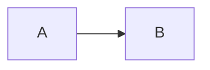
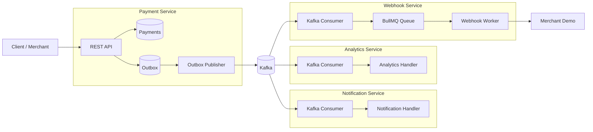
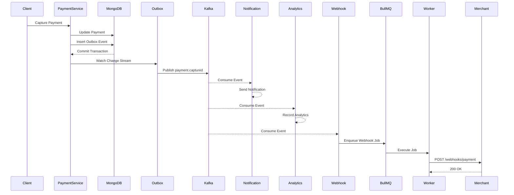
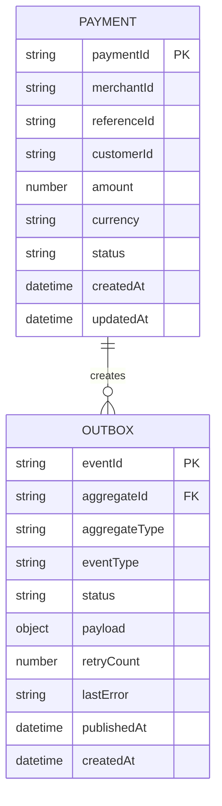
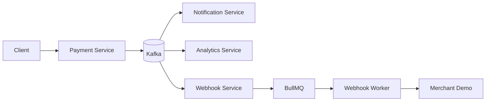
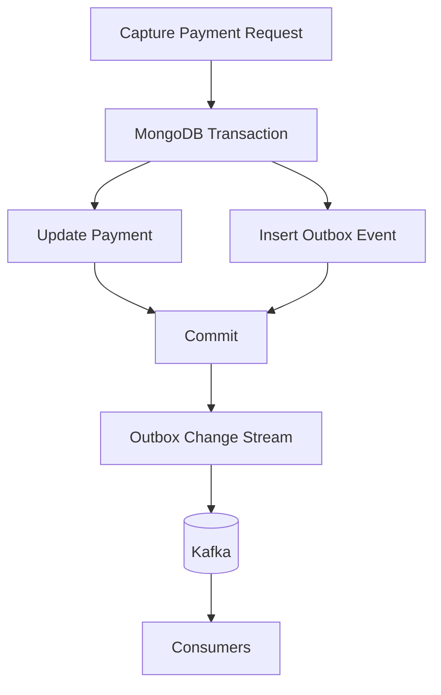

# Payment Gateway – Event-Driven Microservices with Distributed Tracing

A production-inspired payment gateway built using **Node.js**, **MongoDB**, **Kafka**, and **Docker** that demonstrates reliable event-driven communication, distributed tracing, transactional consistency, and asynchronous processing.

This project was built to explore backend architecture patterns commonly used in modern fintech systems rather than simply exposing CRUD APIs.

---

# Architecture

```text
                          ┌─────────────────────┐
                          │   Client / Merchant │
                          └──────────┬──────────┘
                                     │
                                     ▼
                         ┌────────────────────────┐
                         │   Payment Service      │
                         │────────────────────────│
                         │ Create Payment         │
                         │ Capture Payment        │
                         │ Transactional Outbox   │
                         └──────────┬─────────────┘
                                    │
                                    ▼
                             MongoDB Outbox
                                    │
                                    ▼
                                Kafka Topic
                                    │
          ┌─────────────────────────┼──────────────────────────┐
          ▼                         ▼                          ▼
┌──────────────────┐      ┌──────────────────┐      ┌──────────────────┐
│ Notification     │      │ Analytics        │      │ Webhook Service  │
│ Service          │      │ Service          │      │ + BullMQ         │
└──────────────────┘      └──────────────────┘      └─────────┬────────┘
                                                              │
                                                              ▼
                                                     Merchant Demo
```

---

# Features

## Payment Service

* Create payment
* Capture payment
* Transactional Outbox Pattern
* MongoDB transactions
* Kafka producer
* Retryable outbox publisher
* Idempotent payment processing
* Structured logging with Pino
* OpenTelemetry instrumentation
* Distributed tracing

---

## Notification Service

* Kafka consumer
* Event-driven notification processing
* Trace context propagation
* Structured logging

---

## Analytics Service

* Kafka consumer
* Event processing
* Event analytics
* Distributed tracing

---

## Webhook Service

* Kafka consumer
* BullMQ queue
* Automatic retries
* Exponential backoff
* Webhook delivery
* Trace propagation to downstream services

---

## Merchant Demo

* Receives webhook callbacks
* Updates merchant orders
* End-to-end trace continuation

---

# Test



# Architecture Diagram

````markdown

````

---

# Payment Capture Sequence Diagram

````markdown

````

---

# Entity Relationship Diagram

````markdown

````

---

# Distributed Trace Flow

````markdown

````

---

# Transactional Outbox Flow

````markdown

````


# Reliability Patterns

* Transactional Outbox Pattern
* MongoDB ACID Transactions
* Retry Worker
* Exponential Backoff
* Jitter
* Idempotent APIs
* Dead-letter style failure handling after max retries
* BullMQ retry mechanism

---

# Observability

## Structured Logging

* Pino
* JSON logs
* Trace IDs
* Request correlation

---

## Distributed Tracing

OpenTelemetry is used to trace requests across every service.

Current trace flow:

```
Client
    │
    ▼
Payment Service
    │
    ▼
MongoDB
    │
    ▼
Outbox
    │
    ▼
Kafka
    │
    ├────────────► Notification Service
    │
    ├────────────► Analytics Service
    │
    ▼
Webhook Service
    │
    ▼
BullMQ
    │
    ▼
Merchant Demo
```

Trace context is propagated through:

* HTTP
* Kafka Headers
* BullMQ Jobs
* Webhooks

Jaeger is used for visualizing distributed traces.

---

# Technology Stack

### Backend

* Node.js
* Express
* MongoDB
* Mongoose

### Messaging

* Apache Kafka
* KafkaJS

### Queue

* BullMQ
* Redis

### Observability

* OpenTelemetry
* Jaeger
* Pino

### Validation

* Zod

### Infrastructure

* Docker
* Docker Compose

---

# Project Structure

```
payment-gateway/

├── payment-service/
├── notification-service/
├── analytics-service/
├── webhook-service/
├── packages/
│   └── shared/
└── docker-compose.yml
```

The shared package contains reusable infrastructure such as:

* OpenTelemetry
* Logging
* Retry utilities
* Kafka helpers
* Database helpers
* Middleware
* Shared constants

---

# Running the Project

## Clone

```bash
git clone <repository-url>
```

## Install

```bash
npm install
```

## Start

```bash
docker compose up --build
```

---

# Example Flow

1. Client creates a payment.
2. Payment Service stores the payment.
3. Outbox event is created within the same transaction.
4. Outbox publisher publishes the event to Kafka.
5. Notification Service receives the event.
6. Analytics Service records the event.
7. Webhook Service queues webhook delivery.
8. BullMQ worker sends webhook to Merchant Demo.
9. Merchant order status is updated.
10. Entire request is visible as a single distributed trace in Jaeger.

---

# Concepts Demonstrated

* Microservices Architecture
* Event-Driven Architecture
* Transactional Outbox Pattern
* Distributed Systems
* Distributed Tracing
* Context Propagation
* Kafka Messaging
* Asynchronous Processing
* Background Workers
* Retry Strategies
* Exponential Backoff
* Jitter
* MongoDB Transactions
* Idempotency
* Observability
* Structured Logging

---

# Future Improvements

Possible future enhancements include:

* Prometheus metrics
* Grafana dashboards
* Kubernetes deployment
* Circuit Breaker pattern
* Rate limiting
* API Gateway
* Distributed cache
* CI/CD pipeline
* Saga orchestration

---

